# 🚀 E-Training App

<div align="center">

### 📱 A Modern Flutter-Based Learning & Internship Management Platform

**Developed as part of the Excelerate Mobile Application Development Internship**


---

> **Empowering learners through technology by providing a centralized platform for discovering training programs, internships, announcements, and learning opportunities.**

</div>

<div align="center">


</div>

## 📑 Table of Contents

### 📱  Project Documentation

* [📌 Project Status](#-project-status)
* [📱 Project Overview](#-project-overview)
* [🎯 Purpose of the App](#-purpose-of-the-app)
* [✨ Features](#-features)
* [🛠 Technology Stack](#-technology-stack)
* [🏗 System Architecture](#-system-architecture)
* [📂 Project Structure](#-project-structure)
* [📈 Final Application Enhancements](#-final-application-enhancements)
* [🔥 Firebase Collections](#-firebase-collections)
* [📸 Screenshots](#-screenshots)
* [👥 Team Contributions](#-team-contributions)
* [📊 Improvements Based on Evaluation Feedback](#-improvements-based-on-evaluation-feedback)
* [🎯 Learning Outcomes](#-learning-outcomes)
* [🚀 Future Enhancements](#-future-enhancements)

---

### 💻 Complete Setup & Installation Guide

* [💻 Required Software](#-required-software)
* [📦 Flutter Installation](#-flutter-installation)
* [🤖 Android Studio Setup](#-android-studio-setup)
* [📥 Repository Cloning](#-repository-cloning)
* [📚 Dependency Installation](#-dependency-installation)
* [🔥 Firebase Configuration](#-firebase-configuration)
* [▶️ Running the Application](#️-running-the-application)
* [🧪 Testing Guide](#-testing-guide)
* [🛠 Troubleshooting Common Errors](#-troubleshooting-common-errors)
* [📞 Support](#-support)
* [📄 License](#-license)

---

### 🎬 Project Resources

* [🎥 Demo Video](#-demo-video)
* [📥 Download APK](#-download-apk)
* [🙏 Acknowledgements](#-acknowledgements)
* [🏆 Conclusion](#-conclusion)

---

# 📌 Project Status

> **Project Status:** ✅ Completed

The **E-Training App** has been successfully developed as part of the **Excelerate Mobile Application Development Internship**. The project fulfills all core internship deliverables, including Firebase Firestore integration, JSON-based dynamic data management, responsive Flutter UI, form validation, and professional project documentation.

### Current Release

* **Version:** v1.0.0
* **Platform:** Android
* **Development Status:** Completed
* **Documentation Status:** Complete
* **Repository Status:** Portfolio Ready


## 📱 Project Overview

The **E-Training App** is a modern Flutter-based mobile application developed as part of the **Excelerate Mobile Application Development Internship**. The application provides a centralized platform where users can discover training programs, internships, learning resources, and important updates through an intuitive and user-friendly interface.

The project demonstrates the practical implementation of modern mobile application development concepts using **Flutter**, **Firebase Firestore**, and **JSON-based data integration**. It combines responsive UI design, dynamic content loading, cloud database integration, and form validation to deliver a seamless user experience.

The application was designed following modern UI/UX principles with a strong emphasis on performance, usability, maintainability, and scalability. Throughout the four-week internship, the project evolved from wireframes and static interfaces into a fully functional mobile application featuring real-time data storage, dynamic program management, notifications, responsive layouts, and professional application branding.

The E-Training App not only fulfills the internship deliverables but also serves as a portfolio-ready project demonstrating practical experience in Flutter application development, Firebase integration, collaborative software development, version control using GitHub, and professional project documentation.

# 🎯 Purpose of the App

The primary objective of the **E-Training App** is to provide learners with a centralized digital platform that simplifies access to training programs, internships, learning resources, announcements, and user feedback services.

Traditional methods of sharing training opportunities often rely on multiple communication channels, making it difficult for learners to stay updated and manage available opportunities efficiently. This application addresses that challenge by bringing all essential learning resources into a single mobile platform.

The project focuses on solving the following real-world problems:

* Providing a centralized platform for training and internship opportunities.
* Simplifying the discovery of available programs through search and category filtering.
* Allowing users to submit valuable feedback directly through the application.
* Delivering important updates through an integrated Notification Center.
* Demonstrating modern mobile application development practices using Flutter and Firebase.

Beyond meeting the internship objectives, this project also serves as a practical demonstration of industry-standard mobile application development techniques that can be extended into a production-ready learning management platform.

# ✨ Features

## 🔐 Authentication Module

* Secure User Registration
* User Login
* Firebase Firestore Integration
* Input Validation
* Logout Functionality

---

## 🏠 Home Dashboard

* Modern Dashboard Interface
* Interactive Category Cards
* Quick Navigation
* Responsive Layout
* Professional UI Design

---

## 📚 Program Management

* Dynamic Program Listing
* JSON-Based Data Loading
* Program Details Screen
* Search Functionality
* Category Filtering

---

## 🔔 Notification Center

* Dedicated Notification Panel
* Training Updates
* Internship Announcements
* Read/Unread Notification Indicators
* User-Friendly Bottom Sheet Interface

---

## 💬 Feedback Module

* Feedback Submission Form
* Firebase Firestore Integration
* Success & Error Dialogs
* Loading Indicators
* Form Validation

---

## 👤 User Profile

* Profile Information
* Easy Navigation
* Feedback Access
* Secure Logout

---

## 🎨 User Experience

* Splash Screen
* Custom Application Icon
* Custom Application Name
* Responsive UI
* Material Design 3
* Smooth Navigation
* Consistent Color Theme
* Loading Animations
* Error Handling
* Professional Application Branding

# 🛠 Technology Stack

The E-Training App was developed using modern mobile application development technologies to ensure scalability, maintainability, and a seamless user experience.

| Technology             | Purpose                                       |
| ---------------------- | --------------------------------------------- |
| **Flutter**            | Cross-platform mobile application development |
| **Dart**               | Primary programming language                  |
| **Firebase Firestore** | Cloud database for user and feedback data     |
| **Firebase Core**      | Firebase initialization and configuration     |
| **JSON**               | Dynamic program data management               |
| **Material Design 3**  | Modern and responsive user interface          |
| **Git & GitHub**       | Version control and collaborative development |
| **Android Studio**     | Development environment and Android emulator  |
| **Visual Studio Code** | Source code editor                            |
| **FlutterFire CLI**    | Firebase configuration for Flutter            |

---

### Core Flutter Concepts Implemented

* Stateful & Stateless Widgets
* Navigation & Routing
* Form Validation
* Custom Widgets
* Dialogs & Bottom Sheets
* Responsive Layouts
* Asset Management
* JSON Parsing
* Firebase Firestore CRUD Operations
* Loading States & Error Handling

# 🏗 System Architecture

The application follows a modular Flutter architecture where each feature is separated into dedicated screens, widgets, and data sources. This structure improves maintainability, readability, and future scalability.

```text
                    User
                      │
                      ▼
              Flutter Application
                      │
      ┌───────────────┼───────────────┐
      │                               │
      ▼                               ▼
 Flutter UI                    Local JSON Data
      │                               │
      │                               ▼
      │                     Program Listing Module
      │
      ▼
 Navigation & Business Logic
      │
      ▼
 Firebase Firestore
      │
      ├──────────────┐
      ▼              ▼
 Users Collection   Feedback Collection
```

### Architecture Components

#### Presentation Layer

Responsible for displaying the user interface and handling user interactions.

* Splash Screen
* Login Screen
* Registration Screen
* Home Screen
* Program Listing Screen
* Program Details Screen
* Feedback Screen
* Profile Screen

---

#### Business Logic Layer

Handles application flow and user interactions.

* Navigation Management
* Search & Filtering
* Form Validation
* Notification Handling
* Loading & Error States

---

#### Data Layer

Responsible for retrieving and storing application data.

* JSON-based Program Data
* Firebase Firestore
* User Information
* Feedback Records

# 📂 Project Structure

The project follows a modular Flutter project structure, separating screens, widgets, assets, and Firebase configuration for better maintainability and scalability.

```text
E-Training-App/
│
├── android/
├── ios/
├── lib/
│   ├── screens/
│   │   ├── splash_screen.dart
│   │   ├── login_screen.dart
│   │   ├── registration_screen.dart
│   │   ├── home_screen.dart
│   │   ├── program_listing_screen.dart
│   │   ├── program_details_screen.dart
│   │   ├── profile_screen.dart
│   │   └── feedback_screen.dart
│   │
│   ├── widgets/
│   │   ├── category_card.dart
│   │   ├── custom_dialog.dart
│   │   ├── notification_model.dart
│   │   └── ...
│   │
│   ├── firebase_options.dart
│   └── main.dart
│
├── assets/
│   ├── data/
│   │   └── programs.json
│   │
│   └── images/
│       └── app_icon.png
│
├── screenshots/
├── README.md
├── pubspec.yaml
└── .gitignore
```

### Folder Description

* **lib/screens/** – Contains all application screens.
* **lib/widgets/** – Reusable UI components and dialogs.
* **assets/data/** – JSON data source for training programs.
* **assets/images/** – Application images and branding assets.
* **screenshots/** – Screenshots used in documentation.
* **firebase_options.dart** – Firebase configuration generated using FlutterFire CLI.

# 📈 Final Application Enhancements

During the final week of the internship, the application was refined and enhanced to improve usability, performance, documentation, and overall user experience.

## 🎨 User Interface Enhancements

* Implemented a professional animated Splash Screen.
* Added a custom application icon.
* Updated the application name for professional branding.
* Improved overall UI consistency across all screens.
* Enhanced responsiveness for different screen sizes and font scaling.

---

## 🔔 Notification System

* Introduced a dedicated Notification Center.
* Displayed announcements as notifications.
* Added read/unread notification indicators.
* Improved user accessibility using a bottom sheet interface.

---

## ⚡ Performance Improvements

* Improved navigation flow.
* Optimized loading indicators.
* Enhanced form validation.
* Fixed feedback navigation issues.
* Improved overall application stability.

---

## 📄 Documentation Improvements

* Updated the project README.
* Organized GitHub repository structure.
* Added application screenshots.
* Improved setup instructions.
* Prepared the project for portfolio presentation.

---

## 🐞 Bug Fixes

* Fixed feedback submission navigation.
* Improved responsive layouts.
* Fixed large font scaling issues.
* Updated splash screen navigation.
* Improved notification handling.
* Resolved application branding inconsistencies.

# 🔥 Firebase Collections

The application uses **Firebase Firestore** as its cloud database to securely store user information and feedback submissions.

---

## 📂 Users Collection

Stores the registration details of users.

| Field    | Data Type | Description                                             |
| -------- | --------- | ------------------------------------------------------- |
| name     | String    | User's full name                                        |
| email    | String    | Registered email address                                |
| password | String    | User password *(for internship demonstration purposes)* |

**Example Document**

```json
{
  "name": "John Doe",
  "email": "john@example.com",
  "password": "********"
}
```

---

## 📂 Feedback Collection

Stores feedback submitted by users.

| Field     | Data Type | Description              |
| --------- | --------- | ------------------------ |
| name      | String    | User's name              |
| email     | String    | Registered email         |
| feedback  | String    | User feedback            |
| createdAt | Timestamp | Submission date and time |

**Example Document**

```json
{
  "name": "John Doe",
  "email": "john@example.com",
  "feedback": "Excellent learning platform!",
  "createdAt": "Timestamp"
}
```

---

## 🔄 Data Flow

```text
User Interaction
        │
        ▼
Flutter Form Validation
        │
        ▼
Firebase Firestore
        │
        ├──────────────┐
        ▼              ▼
Users Collection   Feedback Collection
```

This integration demonstrates real-time cloud data storage, input validation, and seamless interaction between the Flutter application and Firebase Firestore.

# 📸 Screenshots

The following screenshots showcase the user interface and key functionalities of the E-Training App.

## 🚀 Splash Screen

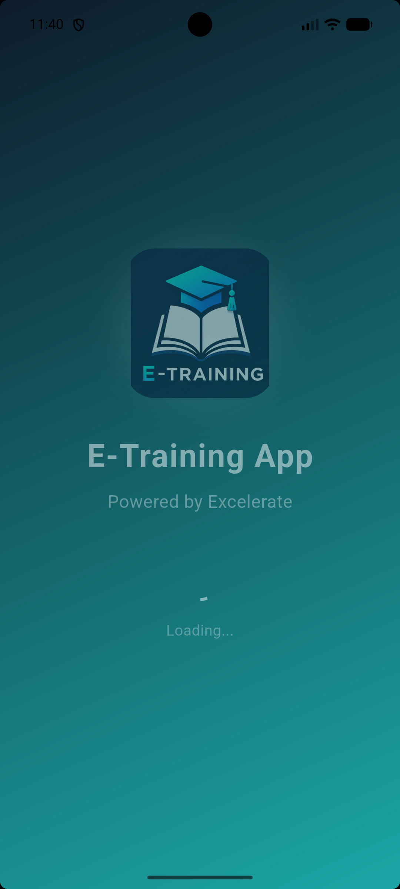

---

## 🔐 Login Screen

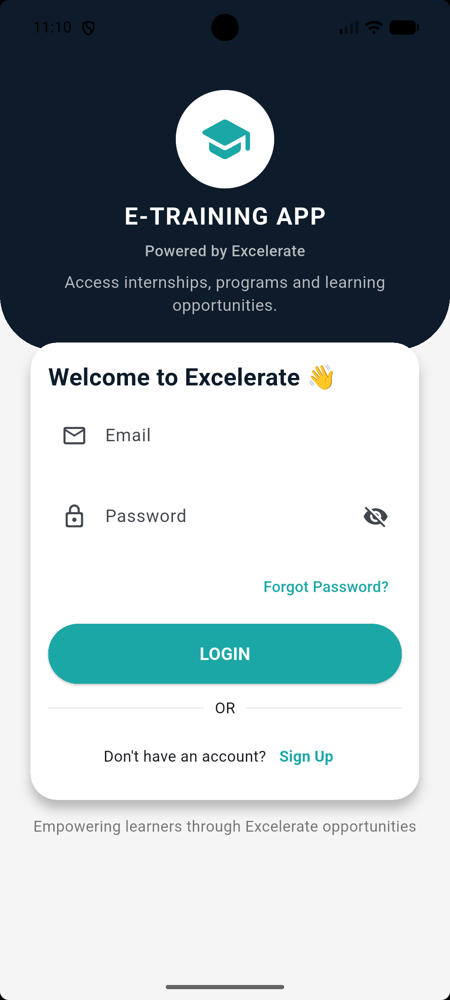

---

## 📝 Registration Screen

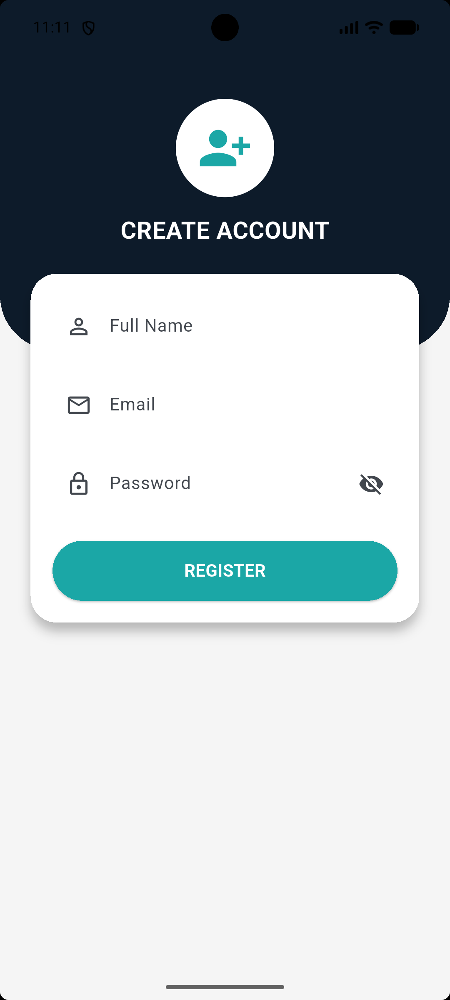

---

## 🏠 Home Dashboard

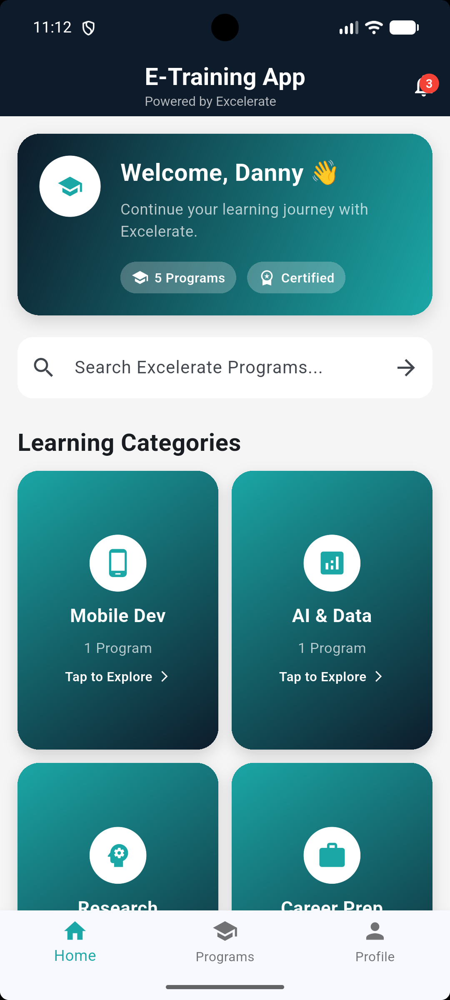
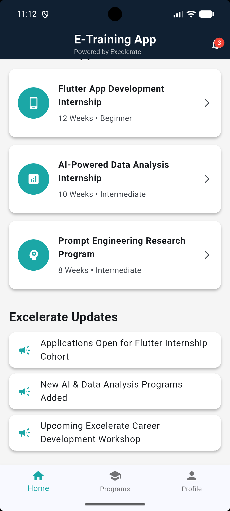

---

## 🔔 Notification Center

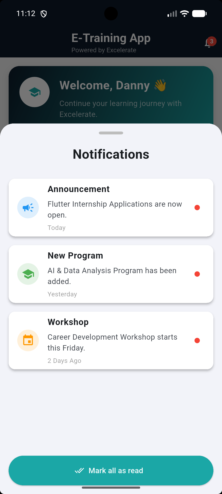

---

## 📚 Program Listing

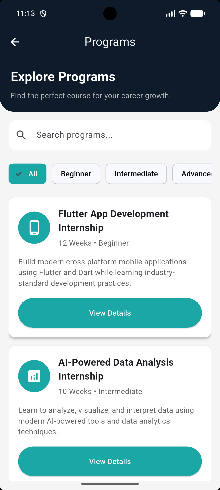
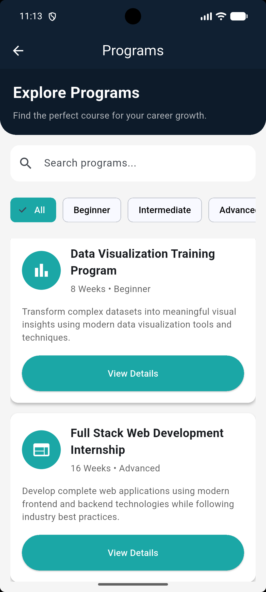

---

## 📖 Program Details

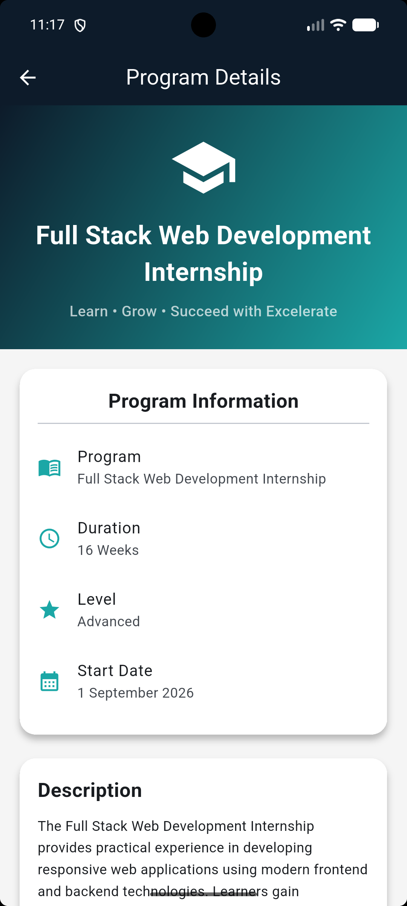
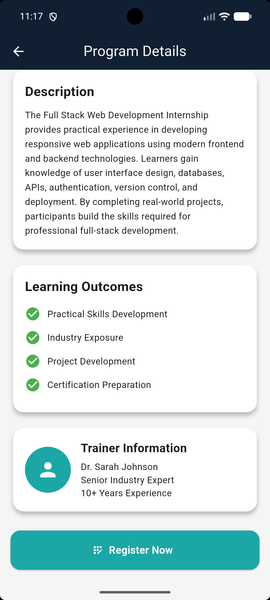

---

## 💬 Feedback Module

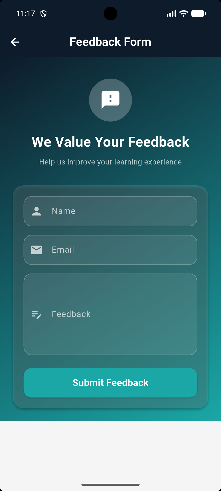

---

## 👤 User Profile

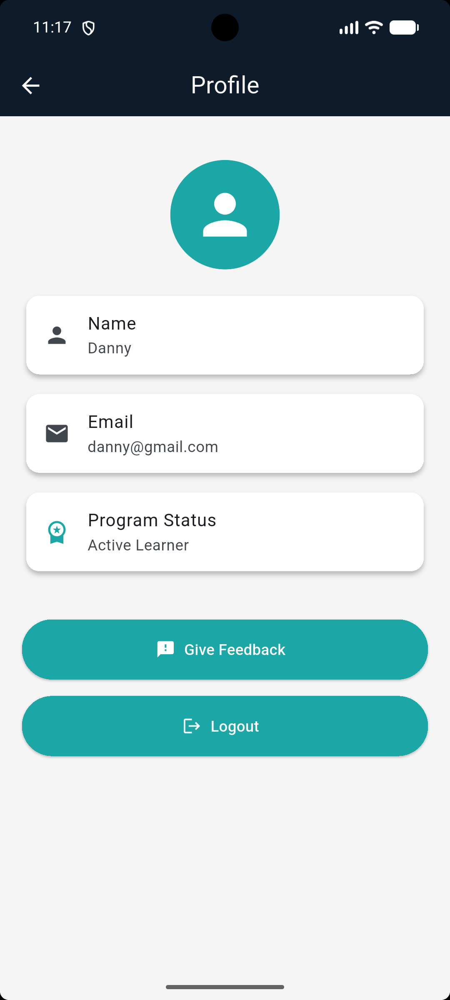

---

Additional screenshots demonstrating Firebase integration, validation, loading states, and GitHub repository structure are available in the **screenshots/** directory.

# 👥 Team Contributions

This project was developed collaboratively by a six-member team during the **Excelerate Mobile Application Development Internship**. Responsibilities were distributed based on individual strengths while ensuring continuous collaboration throughout the development lifecycle.

| Team Member                | Primary Responsibility                                                                                                                                                                                    |
| -------------------------- | --------------------------------------------------------------------------------------------------------------------------------------------------------------------------------------------------------- |
| **ShaikMohammad Abraar (Team Leader)** | Project planning, application architecture, Firebase integration, JSON implementation, splash screen,Authentication module, notifications, final integration, bug fixing, APK generation,demo video, deployment, and project coordination. |
| **Alfred Nyongesa**               |  user registration, login functionality, validation, and Firebase user management.                                                                                                  |
| **Umaima Auwal**               | Home dashboard, program listing, program details, search functionality, category filtering, and JSON data handling.                                                                                       |
| **Sujith**               | Feedback module, profile screen, Firestore integration, loading indicators, dialogs, and navigation improvements.                                                                                         |
| **Jeffery Swatson**               | UI/UX enhancements, reusable widgets, responsive layouts, animations, testing support, and application branding.                                                                                          |
| **Shaik Ruksana**               | GitHub repository management, documentation, README preparation, screenshots,  final report, and submission support.                                                                           |

Throughout the internship, all team members actively participated in discussions, testing, code reviews, and integration activities to ensure the successful completion of the project.

# 📊 Improvements Based on Evaluation Feedback

The Week 4 submission incorporates improvements based on the evaluation received after Week 3.

### ✅ Documentation Improvements

* Expanded the README with comprehensive project documentation.
* Added setup and installation instructions.
* Documented Firebase and JSON integration.
* Included project architecture and folder structure.

---

### ✅ Application Enhancements

* Added a professional animated splash screen.
* Implemented custom application branding.
* Introduced a dedicated Notification Center.
* Improved navigation and user experience.
* Enhanced responsiveness across different screen sizes.

---

### ✅ Technical Improvements

* Improved form validation.
* Added loading indicators.
* Enhanced error handling.
* Optimized Firebase integration.
* Improved application stability and performance.

---

### ✅ Repository Improvements

* Organized the GitHub repository.
* Updated documentation.
* Added screenshots.
* Maintained meaningful commit history.
* Prepared the project for long-term portfolio usage.

These enhancements demonstrate the team's commitment to continuous improvement and the application of feedback throughout the internship.

# 🎯 Learning Outcomes

Throughout the four-week internship, the team gained practical experience in designing, developing, testing, documenting, and presenting a complete Flutter application.

## Technical Skills

* Flutter Application Development
* Dart Programming
* Firebase Firestore Integration
* JSON Data Management
* Form Validation
* Responsive UI Design
* Navigation & Routing
* Git & GitHub Version Control
* APK Generation & Deployment

---

## Professional Skills

* Team Collaboration
* Project Planning
* Task Management
* Documentation
* Problem Solving
* Debugging
* Software Testing
* Presentation Skills

---

## Internship Outcomes

The internship provided valuable exposure to real-world mobile application development practices and strengthened our understanding of collaborative software engineering, cloud integration, and professional project documentation.

# 🚀 Future Enhancements

Although the current version successfully meets the internship objectives, several enhancements are planned for future releases.

### Planned Features

* Firebase Authentication
* Password Encryption
* Push Notifications
* User Profile Editing
* Dark Mode
* Bookmark/Favorite Programs
* Advanced Search & Filtering
* Offline Data Support
* Cloud Image Storage
* Admin Dashboard

---

### 🌟 Planned Version 2.0

The next version of the E-Training App aims to introduce more advanced features and production-ready improvements, including:

* Firebase Authentication
* Secure Firestore Security Rules
* Profile Editing
* Push Notifications
* Dark Mode
* Bookmark/Favorite Programs
* Offline Data Support
* Clean Architecture (MVVM)
* State Management using Provider or Riverpod
* Unit & Widget Testing
* CI/CD Integration with GitHub Actions

These enhancements will further improve the application's security, scalability, maintainability, and overall user experience while preparing it for real-world deployment.


### Technical Improvements

* State Management using Provider or Riverpod
* Clean Architecture / MVVM
* Unit Testing & Widget Testing
* CI/CD Pipeline
* GitHub Actions
* Improved Firestore Security Rules

---

These enhancements will further improve scalability, security, maintainability, and overall user experience, making the application suitable for production-level deployment.


# 💻 Complete Setup & Installation Guide

This guide explains how to set up, configure, and run the **E-Training App** on your local machine.

---

# 💻 Required Software

Before running the project, ensure the following software is installed on your system.

| Software                     | Recommended Version   |
| ---------------------------- | --------------------- |
| Flutter SDK                  | Latest Stable Version |
| Dart SDK                     | Included with Flutter |
| Android Studio               | Latest Version        |
| Visual Studio Code           | Latest Version        |
| Git                          | Latest Version        |
| Firebase CLI *(Optional)*    | Latest Version        |
| FlutterFire CLI *(Optional)* | Latest Version        |

---

# 📦 Flutter Installation

1. Download Flutter from the official Flutter website.

2. Extract the Flutter SDK.

3. Add Flutter to your system PATH.

4. Verify the installation by running:

```bash
flutter doctor
```

Ensure all required components are installed successfully before continuing.

---

# 🤖 Android Studio Setup

1. Install Android Studio.

2. Install:

* Android SDK
* Android SDK Platform
* Android SDK Command-line Tools

3. Install the Flutter and Dart plugins.

4. Create or start an Android Emulator.

5. Verify the emulator is detected by Flutter:

```bash
flutter devices
```

---

# 📥 Repository Cloning

Clone the project using Git.

```bash
git clone https://github.com/your-username/E-Training-App.git
```

Navigate into the project folder.

```bash
cd E-Training-App
```

---

# 📚 Dependency Installation

Download all Flutter dependencies.

```bash
flutter pub get
```

Verify that all packages are installed successfully.

---

# 🔥 Firebase Configuration (Android)

The application uses **Firebase Firestore** for cloud data storage.

### Steps

1. Create a Firebase Project.

2. Register an Android application.

3. Download:

```
google-services.json
```

4. Place it inside:

```
android/app/
```

5. Configure Firebase using FlutterFire CLI.

```bash
flutterfire configure
```

This generates:

```
lib/firebase_options.dart
```

which initializes Firebase automatically within the application.

---

# ▶️ Running the Application

Ensure an emulator or physical Android device is connected.

Run:

```bash
flutter run
```

To generate a release APK:

```bash
flutter build apk --release
```

The generated APK will be located at:

```
build/app/outputs/flutter-apk/app-release.apk
```

---

# 🧪 Testing Guide

Before submission, verify the following features.

### Authentication

* User Registration
* User Login
* Logout

---

### Program Module

* Program Listing
* Search Functionality
* Category Filtering
* Program Details

---

### Firebase

* User Registration stored in Firestore
* Feedback stored in Firestore

---

### User Interface

* Splash Screen
* Notification Center
* Responsive Layout
* Loading Indicators
* Success & Error Dialogs

---

### Overall Testing

Ensure the application functions correctly without crashes and provides a smooth user experience.

---

# 🛠 Troubleshooting Common Errors

### Flutter packages not found

Run:

```bash
flutter pub get
```

---

### Build issues

Run:

```bash
flutter clean
flutter pub get
```

Then rebuild the application.

---

### Emulator not detected

Verify available devices.

```bash
flutter devices
```

Start an emulator if no devices are listed.

---

### Firebase connection issues

Ensure:

* Firebase is configured correctly.
* `google-services.json` is present.
* `firebase_options.dart` exists.
* Internet connectivity is available.

---

### Gradle build failures

Update Gradle dependencies and execute:

```bash
flutter clean
flutter pub get
```

before rebuilding.

---

# 📞 Support

For questions, suggestions, or issues related to the project, please open an issue in the GitHub repository or contact the project contributors.

We welcome constructive feedback and ideas for future improvements.

---

# 📄 License

This project was developed for educational purposes as part of the **Excelerate Mobile Application Development Internship**.

It may be used for learning, demonstration, and portfolio purposes.

For commercial usage or redistribution, please obtain permission from the project contributors.


### 🎬 Project Resources

This section provides quick access to all supplementary resources related to the E-Training App.

# 🎥 Demo Video

A complete walkthrough of the application has been prepared to demonstrate the key features and overall workflow of the E-Training App.

The demonstration includes:

* Splash Screen
* User Registration
* User Login
* Home Dashboard
* Notification Center
* Program Listing
* Search & Category Filtering
* Program Details
* Feedback Submission
* Firebase Firestore Integration
* Profile Management
* Logout Functionality

> **Demo Video:** *(https://drive.google.com/file/d/114oGQp8GrXyCd8mJ3rnyQBk_pcLuP8pD/view?usp=drive_link)*

# 📥 Download APK

The latest release of the **E-Training App** can be downloaded from the **Releases** section of this repository.

### Latest Release

* **Version:** v1.0.0
* **Platform:** Android
* **Build Type:** Release APK

> **APK Download:** *(https://github.com/SAbraar13/Team1-Excelerate-MADJune26-E-Training-App/releases/tag/v1.0.0)*


# 🙏 Acknowledgements

We sincerely express our gratitude to **Excelerate** for providing the opportunity to participate in the **Mobile Application Development Internship**.

This internship offered valuable hands-on experience in Flutter development, Firebase integration, collaborative software engineering, GitHub version control, project documentation, testing, and mobile application deployment.

We also thank our mentors and team members for their continuous guidance, collaboration, and support throughout the four-week internship journey. Their feedback and encouragement played a significant role in the successful completion of this project.

### 🏆 Conclusion

The **E-Training App** represents the successful completion of a four-week journey through the **Excelerate Mobile Application Development Internship**. From initial planning and UI design to Firebase integration, JSON-based data management, testing, documentation, and deployment, this project demonstrates the complete lifecycle of modern mobile application development.

Throughout the internship, our team transformed a conceptual idea into a fully functional Flutter application featuring user authentication, dynamic program management, real-time cloud data storage with Firebase Firestore, responsive user interfaces, professional branding, and comprehensive technical documentation. Every milestone contributed to strengthening our understanding of software engineering principles, collaborative development, debugging, testing, and project management.

Beyond fulfilling the internship requirements, this project serves as a strong portfolio piece that reflects our commitment to continuous learning, teamwork, problem-solving, and the adoption of industry best practices. It showcases our ability to design, develop, document, and present a production-inspired mobile application using modern technologies.

As we continue our journey as software developers, the E-Training App will serve as a foundation for future enhancements, including secure authentication, advanced state management, improved architecture, enhanced security, and additional user-focused features. The experience gained through this internship has prepared us to confidently take on future academic, professional, and real-world software development challenges.

We sincerely thank **Excelerate** for providing this valuable learning opportunity and enabling us to apply theoretical knowledge in a practical, collaborative, and industry-oriented environment. This project marks an important milestone in our growth as aspiring software engineers and motivates us to continue building innovative, impactful, and user-centric applications.